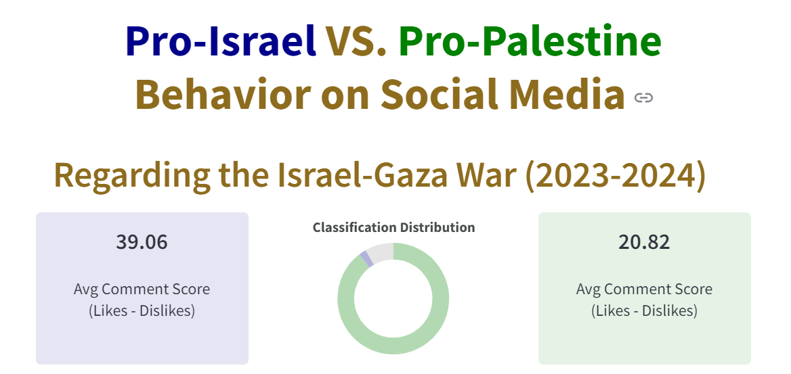
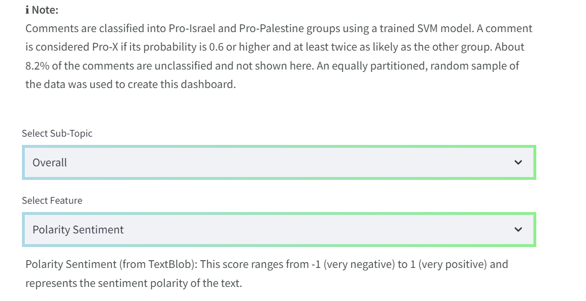
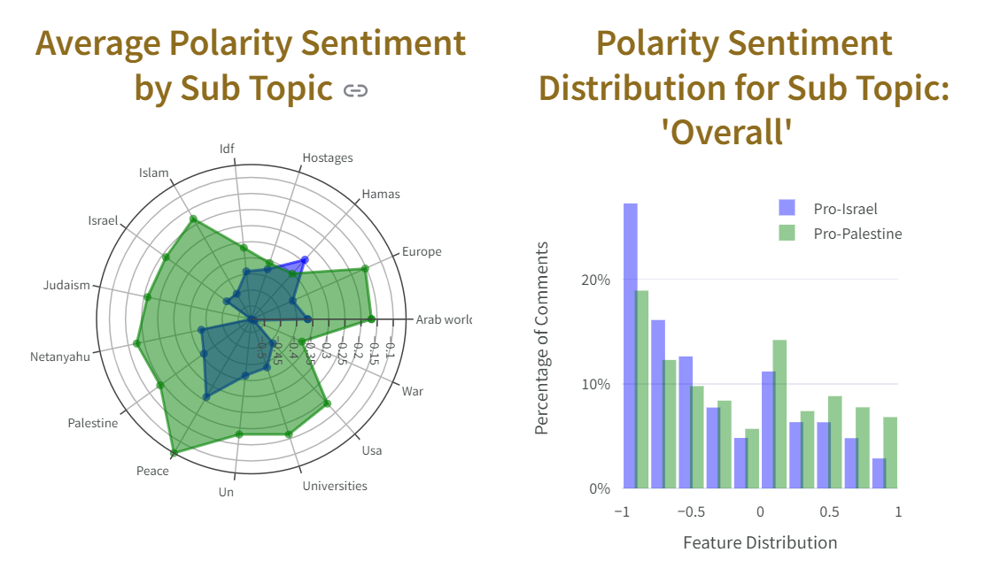

# Visualization Dashboard to compare the online behavior of Pro-Palestinians vs. Pro-Israelis on Reddit, regarding the Israel-Gaza war (2023-2024)

This project provides a visualization dashboard to analyze and compare Pro-Palestinian and Pro-Israel online content & comments based on various metrics such as Toxicity Score, Sentiment Distribution, and more, while breaking these aspects to different topics and speech type. The dashboard is built using Streamlit and Plotly for interactive visualizations.

The original dataset is available here:

https://www.kaggle.com/datasets/asaniczka/reddit-on-israel-palestine-daily-updated

The dashboard is available on:

https://israel-palestine-war-reddit-analysis-6nekyrcmznptivya9ogcpl.streamlit.app/

All dataprocess codefiles are available in this repository.

A comprehensive report is publicly available (in Hebrew) on my Google Drive, in this link:

[https://drive.google.com/drive/folders/1J3cfvAIdATJIkOix8Y02kDcxJH1cFhGy](https://drive.google.com/file/d/1iNVXmrpGq3TR_bNZMI8Mt3pR62XbdZBz/view?usp=drive_link)

## Dashboard





## Main Tasks (Questions Answered)

1. **Sentiment Analysis**: Analyze the sentiment distribution for different subtopics within Pro-Palestinian and Pro-Israel content.
2. **Toxicity and Controversiality**: Compare the Toxicity Score for Pro-Palestinian and Pro-Israel content, regarding different sub topics - conflict related.
3. **Content Representation**: Visualize the proportion of Pro-Palestinian vs. Pro-Israel comments and their average scores (positive / negative responses).
4. **Factual vs. Emotional Speech**: Compare the factual and emotional speech patterns for both groups using a heatmap.

## How to Activate the App

### Prerequisites

Ensure you have Python installed on your machine. You will also need to install the required Python packages. You can do this by running:

```bash
pip install --user -r requirements.txt

```
In additions, be sure to open a local folder, where you'll keep the data zip file, with the app.py file and the requirements file.

### Run the App

Commands are written for powershell but can easily be adjusted to other terminals.

```bash
streamlit run app.py
```

After running the app, Streamlit will start a local web server and open a new tab in your default web browser, displaying the dashboard. If it doesn't automatically open, you can manually navigate to the URL shown in the terminal (usually http://localhost:8501).

### Push Updates to GIT

Push code updates to GitHub directly.

```bash
git status
git add app.py  # And any additional file you wish to directly update
git commit -m "Explain why you are disrupting Git peace and quiet (what are the changes)"
git push -u origin master
```

