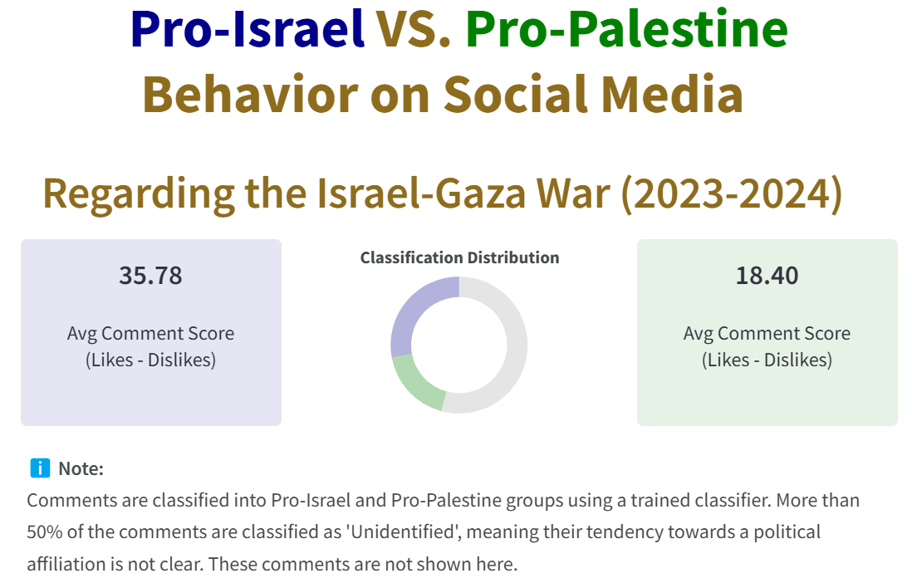
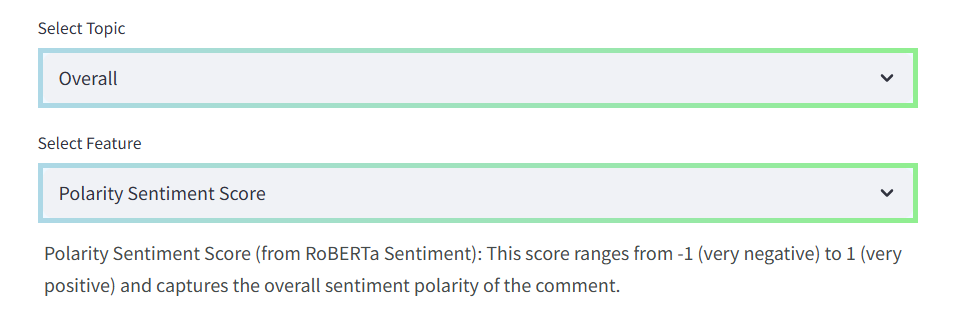
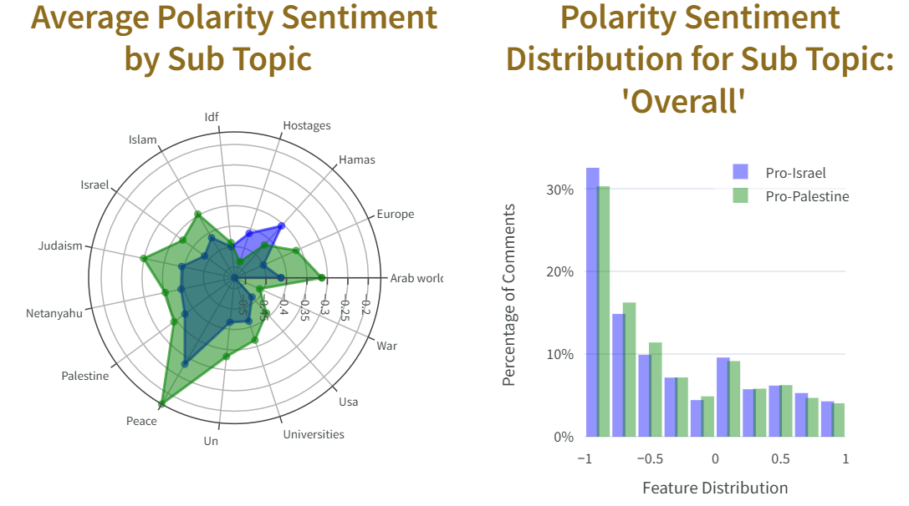
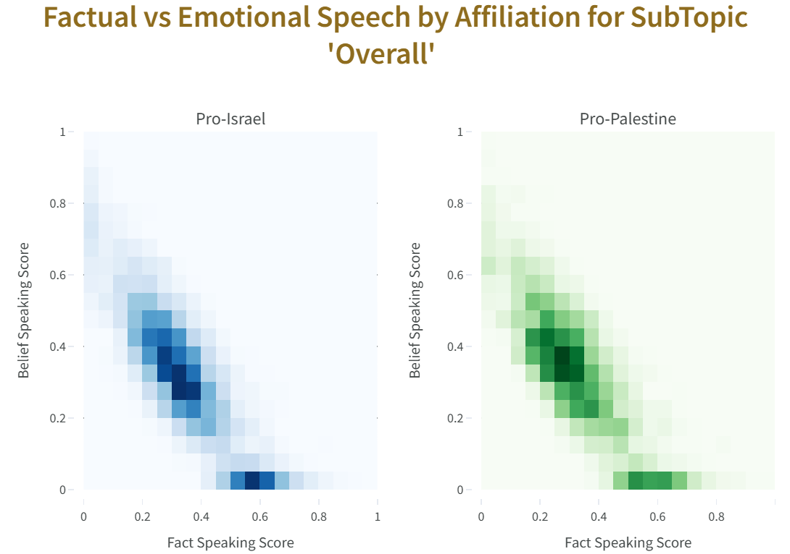

# Comparative Analysis of the Online Behavior of Pro-Palestinians vs. Pro-Israelis on Reddit, Regarding the Israel-Palestine War (OCT 2023-MAY 2025)

This project provides a dashboard to analyze and compare Pro-Palestinian and Pro-Israel online content & comments based on various NLP metrics such as Toxicity Score, Sentiment Distribution, and more, while breaking these aspects to different topics and speech type. The dashboard is built using Streamlit and Plotly for interactive visualizations and allows between and within group comparisons on varius speech derived features.

The original dataset is available on [this link](https://www.kaggle.com/datasets/asaniczka/reddit-on-israel-palestine-daily-updated).

The dashboard is available on [this link](https://israel-palestine-war-reddit-user-behavior-analysis.streamlit.app/) (app might turn to sleep if wasn't used for a while).

The processed dataset, ready for analysis, and the original dataset snapshot used for this research are available in [this link](https://drive.google.com/drive/u/0/folders/1oNywMWfqNQbF2lvMqL63e5gSun5hbrOE).
You will also find there precomputed visualizations that are loaded to the app, due to streamlit's resource constraint.

All dataprocess codefiles are available in this repository.

## Structure

```bash
├── app.py                                          # Streamlit dashboard app (based on processed data)
├── DatasetProcess.ipynb                            # Initial data cleaning and preparation
├── NLPFeatureExtraction.ipynb                      # Advanced NLP feature extraction (toxicity, sentiment, etc.)
├── Images/                                         # Dashboard screenshots for documentation
├── requirements.txt                                # Python dependencies
├── LICENSE                                         # License information
└── README.md                                       # Project overview and instructions
```

## Dashboard






## Main User Tasks (Questions to be Answered Using the Dashboard)

1. **Sentiment Analysis and Emotional Speech**: Analyze the sentiment distribution for different subtopics within Pro-Palestinian and Pro-Israel content.
2. **Toxicity and Profanity**: Compare the Toxicity Score for Pro-Palestinian and Pro-Israel content, regarding different sub topics - conflict related.
3. **Content Representation**: Visualize the proportion of Pro-Palestinian vs. Pro-Israel comments and their average scores (positive / negative responses).
4. **Factual vs. Emotional Speech**: Compare the factual and emotional speech patterns for both groups using a heatmap.

## How to Re-Create the App using Streamlit

### Prerequisites

Ensure you have Python installed on your machine. You will also need to install the required Python packages. You can do this by opening a venv and run:

```bash
python -m venv venv
venv\Scripts\activate
pip install --upgrade pip
pip install -r requirements.txt
```
In additions, be sure to open a local folder, where you'll keep the data zip file, with the app.py file and the requirements file.

### Run the App

Commands are written for powershell but can easily be adjusted to other terminals.

```bash
streamlit run app.py
```

After running the app, Streamlit will start a local web server and open a new tab in your default web browser, displaying the dashboard. If it doesn't automatically open, you can manually navigate to the URL shown in the terminal (usually http://localhost:8501).

### Push Updates to GIT

Push code updates to GitHub directly.

# Related Work: Stance Detection
For users interested in classifying the political affiliation of social media comments, I recommend my related project: [Israel-Palestine Political Affiliation Text Classification](https://github.com/shaharoded/Israel-Palestine-Political-Affiliation-Text-Classification). This study focuses on building a scalable machine learning pipeline to classify comments into Pro-Israel, Pro-Palestinian, and Undefined categories, starting with an unlabeled raw dataset. The classifier leverages advanced contextual embeddings, automated tagging, and fine-tuned classification models such as SVM and XGBoost. This project serves as a complementary tool for deeper classification and benchmarking in ideological discourse analysis, and is also aplying it's predictions on this project's dataset in order to be able to create it's comparative analysis between the 2 groups (Pro-Israel vs. Pro-Palestine).

